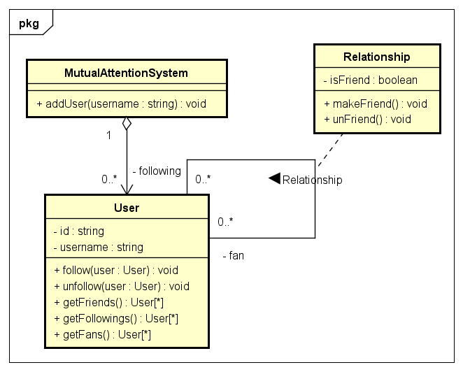

# MutualAttentionSystem

This system manages users and follows other users, if two users follow each other, they become friends.

This project was developed using different coding languages for Web API.

Golang
* You can refer to the following link
[Golang Project](https://github.com/clarkwtc/MutualAttentionSystem/tree/main/go)

Java
* You can refer to the following link
[Java Project](https://github.com/clarkwtc/MutualAttentionSystem/tree/main/java)

## System designing diagram

## Table schema
User 
key | Type 
--- | --- 
id | string 
username | string
createdAt | date

Relationship 
key | Type 
--- | --- 
id | string 
followingId | string
fanId | string
isFriend | boolean
createdAt | date
